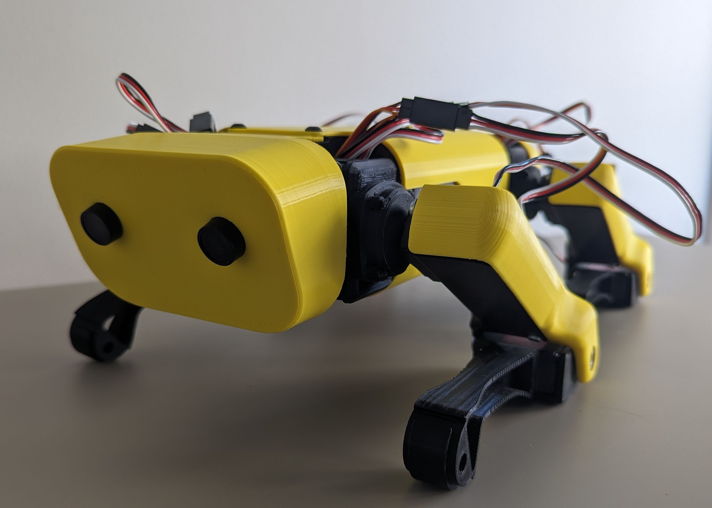

# SpotMicro (Nvidia Jetson Nano)

**The project is still in progress.**

This project is one of implementations of SpotMicro initially created by [KDY0523](https://www.thingiverse.com/kdy0523/designs). 

If you are new to ROS2, you can start by watching [this tutorial](https://www.youtube.com/watch?v=0aPbWsyENA8&list=PLLSegLrePWgJudpPUof4-nVFHGkB62Izy&index=1).

# Software

This project uses ROS2 Galactic. You need update Ubuntu on Nvidia Jetson Nano to version Ubuntu 20.04 and run `install.bash`.

Now you can create a virtual enviroment and install python packages.

## How to build

`colcon build`

## How to start nodes

`ros2 launch quadruped_launcher quadruped.launch.py`

# Material

| Part or module | number | Notes | link | 
|----------------|--------|-------------------|------|
|Nvidia Jetson Nano (Developer Kit)| 1 | A small, powerful computer for embedded applications| [Welectron](https://www.welectron.com/NVIDIA-Jetson-Nano-4GB-Developer-Kit-B01_1)|
| IMX219-83 | 1 | Stereo Camera | [Welectron](https://www.welectron.com/Waveshare-17742-IMX219-83-Stereo-Camera_1)|
| Bluetooth module | 1 | A bluetooth module for Jetson Nano. It could be a usb dongle. This is needed to connect a PS controller.| |
| Wi-Fi module | 1 | A wi-fi module for Jetson Nano. It could be a usb dongle. It's much easier to work via ssh.| |
| PCAA9865 | 1 (2-3 if unreliable manufacturer) | 16-Channel 12-bit PWM/Servo Driver | [AliExpress](https://www.aliexpress.com/item/32466332558.html?spm=a2g0o.order_list.order_list_main.64.593c18028aGZKa) |
| Servos (e.g. DS3225)| 12 | 12 servos, 3 for each leg| [Amazon](https://www.amazon.fr/gp/product/B0819LFDW3/ref=ppx_yo_dt_b_asin_title_o05_s00?ie=UTF8&psc=1) |
| DC-DC Stepdown Module | 2 | A small DC-DC converter to lower the LiPo 2S voltage| |
| Push Button | 1 | Just a button. It's better if this has a led| [AliExpress](https://www.aliexpress.com/item/1005002610826549.html?spm=a2g0o.order_list.order_list_main.43.593c18028aGZKa) |
| Small display| 1 | A small display with I2C interface to shown some information| |
| Mini voltmeter | 1 | It will show a current LiPo voltage. | [AliExpress](https://www.aliexpress.com/item/1005003922676564.html?spm=a2g0o.order_list.order_list_main.55.21ef5e5bR2iLR2&gatewayAdapt=glo2fra) |
| GY-521 | 1 | Gyroscope and Accelerometer | [AliExpress](https://www.aliexpress.com/item/32340949017.html?spm=a2g0o.order_list.order_list_main.65.593c18028aGZKa) |
| Servocable Extension | 12 | I took 12 in case | [AliExpress](https://www.aliexpress.com/item/1005004629299687.html?spm=a2g0o.order_list.order_list_main.59.593c18028aGZKa) |
| F625ZZ | 8 |  Flange ball bearings | [AliExpress](https://www.amazon.fr/gp/product/B07S68283K/ref=ppx_yo_dt_b_asin_title_o03_s00?ie=UTF8&psc=1)|
| Power source | 1 | It's your choice. I used a 2S lipo. | |
| Wire | | | |
| Connectors | | |
| Screws | | | |
| Threaded Insert Assortment Box | 1 | M2/M3/M4/M5 Threaded Insert for connecting printed models  | [Amazon](https://www.amazon.fr/gp/product/B08K1BVGN9/ref=ppx_yo_dt_b_asin_title_o02_s00?ie=UTF8&th=1)|
| PLA | | | |
| FLEX | | | 

# 3D Printing
Most of the details are taken from one of the finished projects. For example, you can look at [these projects](https://www.thingiverse.com/search?q=spotmicro&page=1). 

Because the servos DS3225 are bigger than the servos used in the original project, I had to change the assembly scheme in order to improve connections of the shoulder servos with the main body. It's nothing special, just print few details to increase the length of the body and the covers.

| Part | Number | Project link | Notes | 
|----------------|--------|-------------------|------|
| V1.00_Chassis_PlateJetsonNano.stl | 1 | [Thingiverse(bradprin)](https://www.thingiverse.com/thing:3761340) | A plate for mounting Nvidia Jetson Nano and PCA9865|
| V1.00_Chassis_Right.stl | 1 | [Thingiverse(bradprin)](https://www.thingiverse.com/thing:3761340)  | |
| V1.00_Chassis_Left.stl | 1 | [Thingiverse(bradprin)](https://www.thingiverse.com/thing:3761340)  | |
| L_arm_joint_cls.stl | 2 | [Thingiverse(bradprin)](https://www.thingiverse.com/thing:3445283/files) | I prefer the soulder joint from the original KDY0523's project because of the shape for servo horns.|
| V1.01_Left_MidArm.stl | 2 | [Thingiverse(bradprin)](https://www.thingiverse.com/thing:3761340)  | |
| V1.01_Left_MidArm_Cover.stl | 2 | [Thingiverse(bradprin)](https://www.thingiverse.com/thing:3761340)  | |
| V1.01_Left_Wrist.stl | 2 | [Thingiverse(bradprin)](https://www.thingiverse.com/thing:3761340)  | |
| R_arm_joint_cls.stl | 2 | [Thingiverse(KDY0523)](https://www.thingiverse.com/thing:3445283/files) | I prefer the soulder joint from the original KDY0523's project because of the shape for servo horns.|
| V1.01_Right_MidArm.stl | 2 | [Thingiverse(bradprin)](https://www.thingiverse.com/thing:3761340)  | |
| V1.01_Right_MidArm_Cover.stl | 2 | [Thingiverse(bradprin)](https://www.thingiverse.com/thing:3761340)  | |
| V1.01_Right_Wrist.stl | 2 | [Thingiverse(bradprin)](https://www.thingiverse.com/thing:3761340)  | |
| V1.01_Rear_Shoulder_Inner.stl | 1 | [Thingiverse(bradprin)](https://www.thingiverse.com/thing:3761340)  | |
| V1.01_Rear_Shoulder_Outer.stl | 1 | [Thingiverse(bradprin)](https://www.thingiverse.com/thing:3761340)  | |
| V1.01_Front_Shoulder_Inner.stl | 1 | [Thingiverse(bradprin)](https://www.thingiverse.com/thing:3761340)  | |
| V1.01_Front_Shoulder_Outer.stl | 1 | [Thingiverse(bradprin)](https://www.thingiverse.com/thing:3761340)  | |
| V1.00_Foot.stl | 4 | [Thingiverse(bradprin)](https://www.thingiverse.com/thing:3761340)  | |
| Covers (Top and buttom) | 1 | [Onshape](https://cad.onshape.com/documents/e91ce751a4134fac6087dc9a/w/2c97cdb406c697e3841868dc/e/b5916b3c670933669aaaaf1c) | Created in Onshape. The length was increased. |
| Front cover | 1 | [Onshape](https://cad.onshape.com/documents/9e01bee40010577be9916db1/w/a3e147bdc0528d756297ecc2/e/368df935aa7e4a02748ae26f) | A front cover for IMX219-83 stereo Camera. I don't like the design of this part. It will be changed in the future.|
| Rear cover | 1 | [Onshape](https://cad.onshape.com/documents/4e0e4777120abfd9b26f86a5/w/9ae988b7321c140a2b7638ae/e/ec2d21f1f5317703aca99c19) | A rear cover with spots for the mini voltmeter, the push button and the display. I had problems with displays. So the size of the corresponding will be changed.
| Additional parts | 1 | [Onshape](https://cad.onshape.com/documents/a17f4daeb3c6325db2d772e4/w/88ce61b11aa4787949fede4d/e/fbf2d138e3164cc2c1ed41eb) | Additionals parts to increase the total length of the body.|  